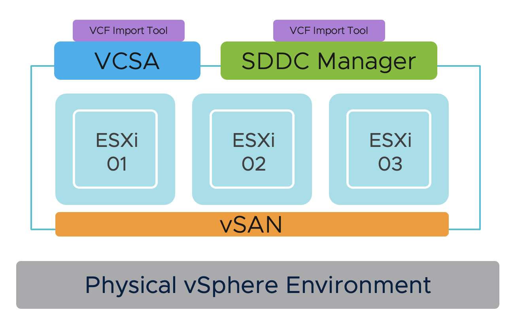
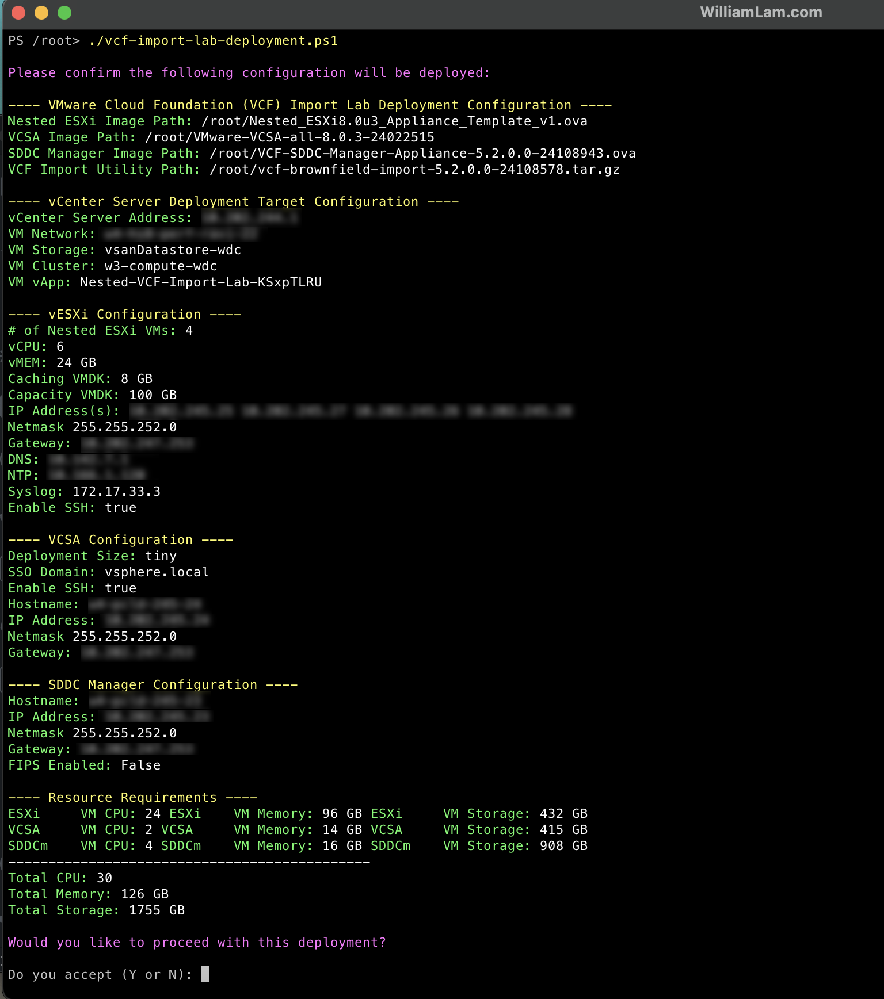
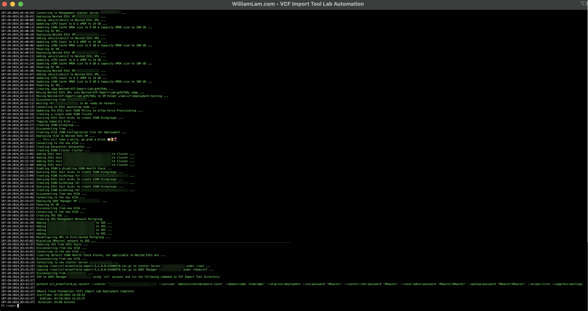
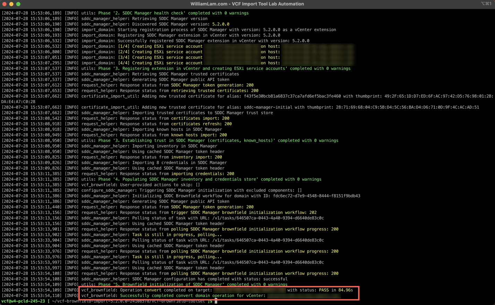
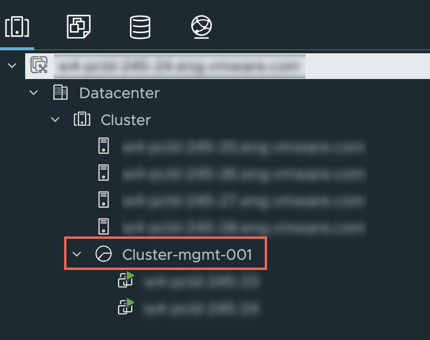

# Automated VMware Cloud Foundation Import Lab Deployment

## Table of Contents

* [Description](#description)
* [Changelog](#changelog)
* [Requirements](#requirements)
* [Configuration](#configuration)
* [Logging](#logging)
* [Sample Execution](#sample-execution)
    * [Lab Deployment Script](#lab-deployment-script)
    * [VCF Import Tool Workflow](#vcf-import-tool-workflow)


## Description

This script automates the deployment of a functional vSphere and vSAN enironment that is managed by a vCenter Server (VCSA) appliance, which the script will deploy including the SDDC Manager appliance, where both will be running within the nesetd environment.

The deployed environment will allow users to easily explore the new [VMware Cloud Foundation (VCF) 5.2 Import Tool](https://docs.vmware.com/en/VMware-Cloud-Foundation/5.2/vcf-admin/GUID-3B3FF4A9-C653-42EA-940F-83B954BE3E70.html) which can convert or import an existing vSphere envrionment into either a VCF Management or Workload Domain.

Below is a diagram of what is deployed as part of the solution and you simply need to have an existing vSphere environment running that is managed by vCenter Server and with enough resources (CPU, Memory and Storage) to deploy this "Nested" lab. See the [Sample Execution](#sample-execution) section to get an idea of what the deployment experience is like.




## Changelog

* *XX/XX/2021**
  * Initial Release for VCF 5.2

## Requirements

| VCF Version | VCF Import Tool                                                                                                                                                                                                                              | SDDC Manager OVA                                                                                                                                                                                                                         | VCSA ISO                                                                                                                                                                                                    | Nested ESXi                                                       |
|-------------|----------------------------------------------------------------------------------------------------------------------------------------------------------------------------------------------------------------------------------------------|------------------------------------------------------------------------------------------------------------------------------------------------------------------------------------------------------------------------------------------|-------------------------------------------------------------------------------------------------------------------------------------------------------------------------------------------------------------|---------------------------------------------------------------------------|
| 5.2         | [ vcf-brownfield-import-5.2.0.0-24108578.tar.gz ]( [https://support.broadcom.com/group/ecx/productfiles?subFamily=VMware%20Cloud%20Foundation&displayGroup=VMware%20Cloud%20Foundation%205.2&release=5.2&os=&servicePk=520823&language=EN ) | [VCF-SDDC-Manager-Appliance-5.2.0.0-24108943.ova](https://support.broadcom.com/group/ecx/productfiles?subFamily=VMware%20Cloud%20Foundation&displayGroup=VMware%20Cloud%20Foundation%205.2&release=5.2&os=&servicePk=520823&language=EN) | [VMware-VCSA-all-8.0.3-24022515.iso](https://support.broadcom.com/group/ecx/productfiles?displayGroup=VMware%20vSphere%20-%20Enterprise%20Plus&release=8.0&os=&servicePk=202628&language=EN&groupId=204421) | [ Nested ESXi 8.0 Update 3 OVA ]( https://community.broadcom.com/flings ) |

* vCenter Server running at least vSphere 7.0 or later
    * If your physical storage is vSAN, please ensure you've applied the following setting as mentioned [here](https://www.williamlam.com/2013/11/how-to-run-nested-esxi-on-top-of-vsan.html)
* ESXi Networking
  * Enable either [MAC Learning](https://williamlam.com/2018/04/native-mac-learning-in-vsphere-6-7-removes-the-need-for-promiscuous-mode-for-nested-esxi.html) or [Promiscuous Mode](https://kb.vmware.com/kb/1004099) on your physical ESXi host networking to ensure proper network connectivity for Nested ESXi workloads
* Resource Requirements
    * Compute
        * Ability to provision VMs with up to 6 vCPU
        * Ability to provision up to 126 GB of memory
        * DRS-enabled Cluster (not required but vApp creation will not be possible)
    * Network
        * 1 x Standard or Distributed Portgroup to deploy all VMs (ESXi, VCSA & SDDC Manager)
           * 5 x IP Addresses for ESXi, VCSA & SDDC Manager VMs
    * Storage
        * Ability to provision up to 1.7 TB of storage (will be thin provisioned)
* Desktop (Windows, Mac or Linux) with latest PowerShell Core and PowerCLI 13 or later installed. See [instructions here](https://blogs.vmware.com/PowerCLI/2018/03/installing-powercli-10-0-0-macos.html) for more details

## Configuration

Before you can run the script, you will need to edit the script and update a number of variables to match your deployment environment. Details on each section is described below including actual values used in my home lab environment.

This section describes the credentials to your physical vCenter Server in which the VCF lab environment will be deployed to:

```console
$VIServer = "FILL_ME_IN"
$VIUsername = "FILL_ME_IN"
$VIPassword = "FILL_ME_IN"
```

This section describes the location of the files required for deployment which must be accessible from where you are running the deployment script.

```console
$NestedESXiApplianceOVA = "/root/Nested_ESXi8.0u3_Appliance_Template_v1.ova"
$VCSAInstallerPath = "/root/VMware-VCSA-all-8.0.3-24022515"
$SDDCManagerOVA = "/root/VCF-SDDC-Manager-Appliance-5.2.0.0-24108943.ova"
$VCFImportToolpath = "/root/vcf-brownfield-import-5.2.0.0-24108578.tar.gz"
```

This section defines the number of Nested ESXi VMs to deploy along with their associated IP Address(s). The names are the display name of the VMs when deployed and you should ensure these are added to your DNS infrastructure. A minimum of four hosts is required.

```console
$NestedESXiHostnameToIPs = @{
    "esxi-01" = "172.30.0.101"
    "esxi-02" = "172.30.0.102"
    "esxi-03" = "172.30.0.103"
    "esxi-04" = "172.30.0.104"
}
```

This section describes the amount resources to allocate to the Nested ESXi VM(s) which will host both the VCSA and SDDC Manager appliances

```console
$NestedESXivCPU = "6"
$NestedESXivMEM = "24" #GB
$NestedESXiCachingvDisk = "8" #GB
$NestedESXiCapacityvDisk = "100" #GB
```

This section describes the configurations that will be used to deploy the SDDC Manager within the Nested ESXi environment:

```console
$SddcManagerDisplayName = "sddcm"
$SddcManagerIP = "172.30.0.100"
$SddcManagerHostname = "sddcm"
$SddcManagerVcfPassword = "VMware1!VMware1!"
$SddcManagerRootPassword = "VMware1!VMware1!"
$SddcManagerAdminPassword = "VMware1!VMware1!"
$SddcManagerLocalPassword = "VMware1!VMware1!"
$SddcManagerBackupPassword = "VMware1!VMware1!"
$SddcManagerFIPSEnable = $false
$VCFManagementDomainName = "wlam-mgmt"
```

This section describes the configurations that will be used to deploy the VCSA within the Nested ESXi environment:

```console
$VCSADeploymentSize = "tiny"
$VCSADisplayName = "vcsa"
$VCSAIPAddress = "172.30.0.99"
$VCSAHostname = "vcsa"
$VCSAPrefix = "22"
$VCSASSODomainName = "vsphere.local"
$VCSASSOPassword = "VMware1!"
$VCSARootPassword = "VMware1!"
$VCSASSHEnable = "true"
```

This section describes the location as well as the generic networking settings applied to Nested ESXi, VCSA & SDDC Manager VMs:

```console
$VMDatacenter = "Palo Alto"
$VMCluster = "Production"
$VMNetwork = "production-network"
$VMDatastore = "vsanDatastore"
$VMNetmask = "255.255.255.0"
$VMGateway = "172.30.0.1"
$VMDNS = "172.30.0.2"
$VMNTP = "172.30.0.3"
$VMPassword = "VMware1!"
$VMDomain = "williamlam.com"
$VMSyslog = "172.30.0.4"
$VMFolder = "wlam-vcf-deployment-testing"
# Applicable to Nested ESXi only
$VMSSH = "true"
```

This section describes the deploy vCenter Server configuration and importantly, make sure the MTU matches your physical networking:
```console
$NewVCDatacenterName = "Datacenter"
$NewVCVSANClusterName = "Cluster"
$NewVCVDSName = "VDS"
$NewVCVDSMTU = 9000 # Needs to match your physical MTU
$NewVCMgmtPortgroupName = "DVPG-Management-Network"
```

Once you have saved your changes, you can now run the PowerCLI script as you normally would.

## Logging

There is additional verbose logging that outputs as a log file in your current working directory **vcf-import-lab-deployment.log**

## Sample Execution

### Lab Deployment Script

Here is a screenshot of running the script if all basic pre-reqs have been met and the confirmation message before starting the deployment:



Here is an example output of a complete deployment:



**Note:** Deployment time will vary based on underlying physical infrastructure resources. In my lab, this took a little over 1hr to complete.

Once completed, you will end up with four Nested ESXi VMs that are fully configured with vSAN and connected to Virtual Distributed Switch (VDS) with vCenter Server Appliance (VCSA) running as a self-managed along with SDDC Manager appliance running within the same vSphere Cluster.


### VCF Import Tool Workflow

Step 1 - The VCF Import Tool has already been copied to the SDDC Manager VM, you simply need to SSH to the VM using `vcf` account to access the tool.

Step 2 - Change into the VCF Import Tool directory which is located within `/home/vcf` directory:

```console
cd vcf-brownfield-import-5.2.0.0-24108578/vcf-brownfield-toolset/
```

Step 2 - Copy the python command output from the orignial deployment script, which will convert the vSphere environment into a VCF Management Domain



Step 3 - You can now login to SDDC Manager using web browser and verify that your vSphere enviornment has now been successfully converted to a VCF Management Domain


When you login to VCF Management Domain vCenter Server, you will also notice a vSphere Resource Pool has been created that contains both the VCSA and SDDC Manager VMs

